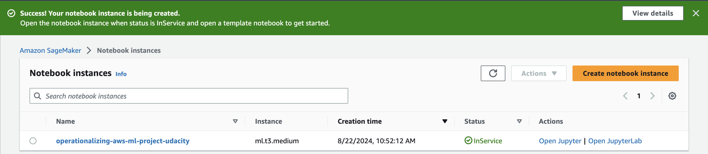
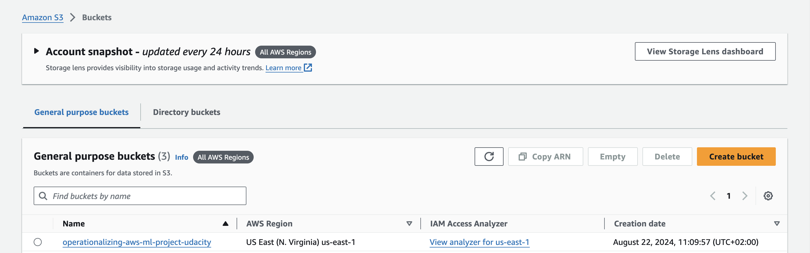
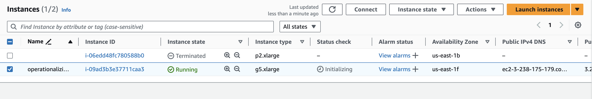
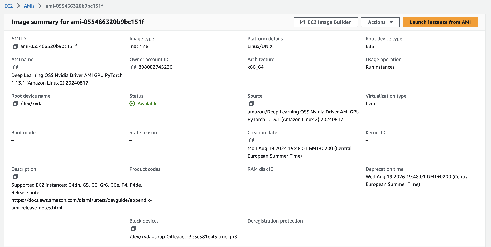
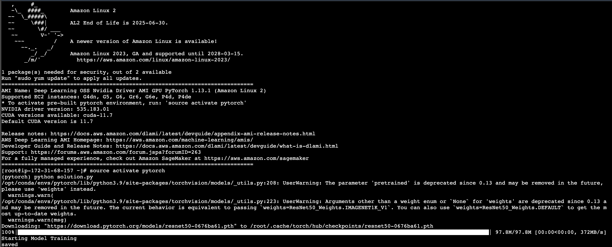
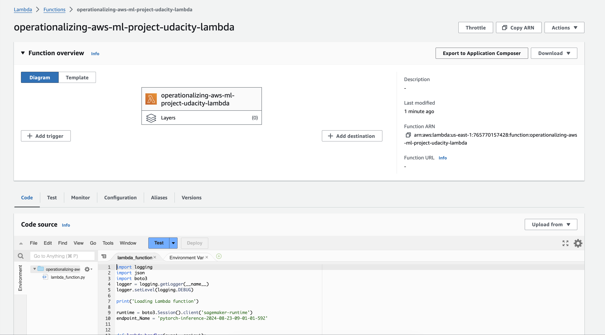
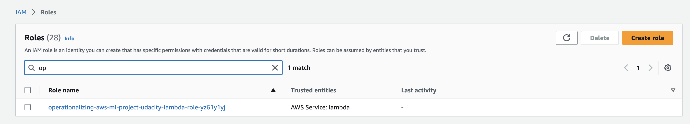
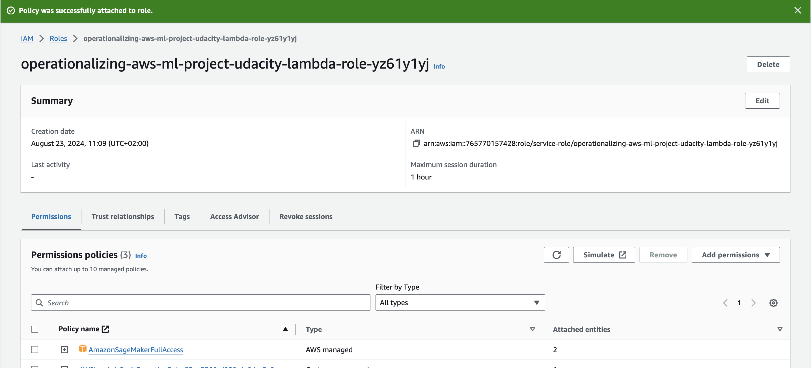
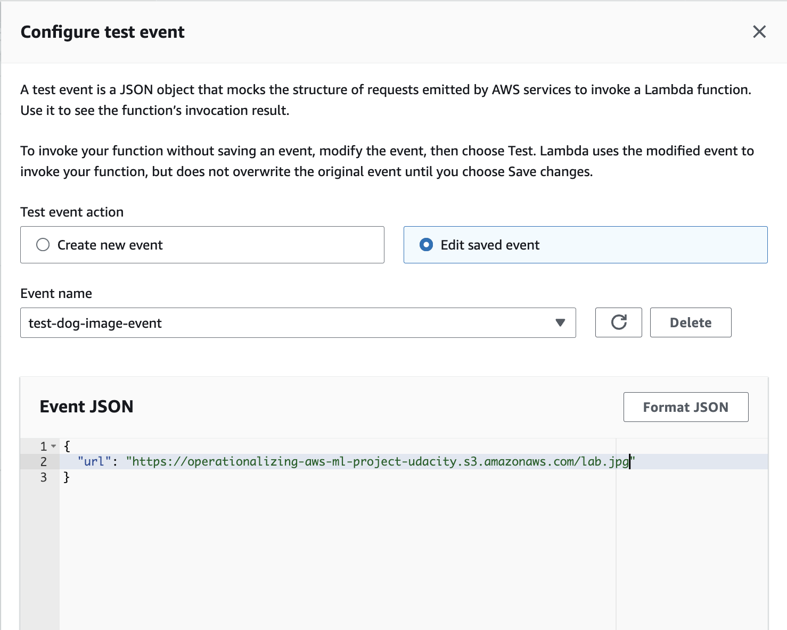
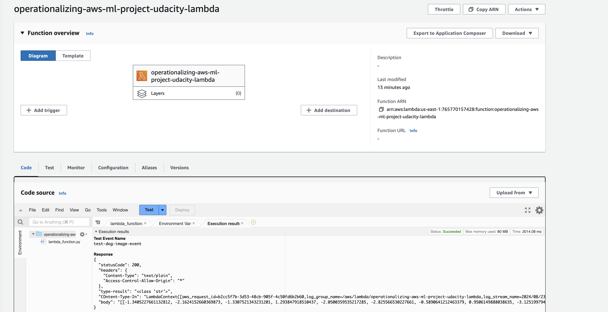

## Training and deployment

I've set up a SageMaker notebook instance of type ml.t3.medium, which is the default option. I believe this instance type is sufficient for running the cells in my notebook, as the actual training will be conducted on other dedicated instances.



I’ve also created a dedicated S3 bucket to use within my notebook for storing the training data and the trained model.



In the notebook, I performed multi-instance training and then deployed the resulting model to a SageMaker inference endpoint.


## EC2 Training

I also trained the model on an EC2 instance. I chose an g5.xlarge instance type because it was the best option given my AWS account’s constraint of a maximum of 4 vCPUs. Additionally, this instance type is one of the few supported by the AMI I selected, and it offers reasonable costs. I opted for the 'Deep Learning OSS Nvidia Driver AMI GPU PyTorch 1.13.1' AMI because it includes all the necessary dependencies and features to optimally run PyTorch model training.





## Lambda function setup

I created a Lambda function to invoke the previously deployed SageMaker endpoint.



Initially, the Lambda function could not invoke the endpoint due to a lack of permissions. I resolved this by assigning the 'SageMakerFullAccess' role to the Lambda function in IAM.




With the new permissions added, I was able to successfully test the Lambda function using the lab.jpg image stored in S3 and received a 200 response.




```json
{
    "statusCode": 200,
    "headers": {
        "Content-Type": "text/plain",
        "Access-Control-Allow-Origin": "*"
    },
    "type-result": "<class 'str'>",
    "COntent-Type-In": "LambdaContext([aws_request_id=efb2929d-e1da-42d5-8620-b933fd5d88fd,log_group_name=/aws/lambda/operationalizing-aws-ml-project-udacity-lambda,log_stream_name=2024/08/23/[$LATEST]050f91743fb5446cb073521c93437876,function_name=operationalizing-aws-ml-project-udacity-lambda,memory_limit_in_mb=128,function_version=$LATEST,invoked_function_arn=arn:aws:lambda:us-east-1:765770157428:function:operationalizing-aws-ml-project-udacity-lambda,client_context=None,identity=CognitoIdentity([cognito_identity_id=None,cognito_identity_pool_id=None])])",
    "body": "[[-1.3405227661132812, -2.1624152660369873, -1.3307521343231201, 1.293847918510437, -2.0500359535217285, -2.825566530227661, -0.5890641212463379, 0.9506149888038635, -3.125199794769287, 0.7088503241539001, 0.8360756635665894, -0.5925388932228088, -0.3834453523159027, 1.3922770023345947, -3.87288761138916, -0.6562303304672241, -1.3113808631896973, 0.38089779019355774, -2.469634771347046, 1.1944749355316162, -2.4560272693634033, 0.18663908541202545, -2.5300419330596924, -2.590580463409424, -2.267550468444824, -2.5254979133605957, -0.8797591924667358, -0.71004319190979, -1.9257458448410034, 0.33457863330841064, -2.105653762817383, -1.2629026174545288, -3.3582592010498047, -0.3757469654083252, -5.283297061920166, -3.0915439128875732, -3.8752450942993164, -1.9270703792572021, -1.3670622110366821, -1.4272453784942627, 0.6857416033744812, -0.20952409505844116, 1.4781063795089722, 0.8312086462974548, 0.9995066523551941, -5.027170181274414, 0.5607823133468628, -1.0152043104171753, -2.137678623199463, -1.2135106325149536, -0.3710368573665619, -5.021118640899658, -3.4663584232330322, -0.8873276114463806, -2.802912473678589, 1.624097228050232, -1.6705918312072754, -2.8714358806610107, -0.5058236122131348, -0.8712177872657776, -2.336249828338623, -2.408808946609497, -3.056994676589966, -4.200441360473633, -0.18305499851703644, -2.0660855770111084, -0.9019116759300232, -2.4320740699768066, 0.7768383026123047, -0.8961078524589539, -0.20393213629722595, -1.0887329578399658, -1.1050353050231934, -1.8720592260360718, -0.7972621321678162, -2.304110527038574, -2.416902780532837, 0.07318788766860962, -2.6490843296051025, -1.4793328046798706, -0.9551690816879272, -3.58402156829834, 0.2678462564945221, 0.3988468050956726, -2.7378053665161133, -2.780207633972168, 0.2056746631860733, -2.6530160903930664, -0.16236475110054016, 0.03927702456712723, -3.9249038696289062, -1.3872344493865967, -4.989504814147949, -2.5428991317749023, -2.2691054344177246, 0.09192509949207306, -0.7675110101699829, -0.8517959713935852, -3.0021517276763916, 0.36334428191185, -3.5711593627929688, -1.619040846824646, -0.40116381645202637, -1.5444121360778809, -1.7935690879821777, -4.0535783767700195, -1.21657133102417, -1.0412863492965698, 0.415031373500824, -0.6184428334236145, -0.35689032077789307, -1.6072046756744385, -2.7903738021850586, -1.1637834310531616, -3.131232261657715, -0.9452006220817566, -0.8178279995918274, 0.7168484330177307, -2.911775588989258, 1.2839666604995728, 0.5409987568855286, -2.0550522804260254, -0.4418593645095825, -3.548677444458008, -3.323620557785034, -2.8082003593444824, -0.5989183187484741, -1.0795096158981323, -5.6200056076049805, -4.49232292175293, -3.7246766090393066, -0.7903283834457397, -2.9196016788482666]]"
}
```
From a security perspective, this is not the optimal solution, as the permissions granted are too broad for this Lambda function. A better approach would be to grant the Lambda function only the necessary InvokeFunction permission for the specific SageMaker endpoint resource.


## Concurrency and auto-scaling

To improve the performance and scalability of the Lambda function and SageMaker endpoint, I set up concurrency and auto-scaling.

For the Lambda function, I configured reserved concurrency to handle up to 10 simultaneous executions, which ensures the function can handle increased traffic while preventing it from overloading other parts of the system.

For the SageMaker endpoint, I enabled auto-scaling to adjust the number of instances based on the request load. I set a minimum of 1 instance to ensure availability and a maximum of 4 instances to balance cost and performance effectively.

These configurations were chosen to maintain optimal performance while controlling costs and ensuring reliability.
